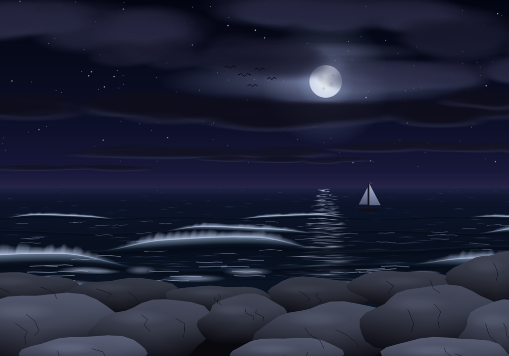

# Computer Graphics Assignments

**Author:** Altynay Yertay

| Folder | Assignment |
|---|---|
| [`ay240782_a1`](ay240782_a1/) | Assignment 1: four basic OpenGL programs (see its [README](ay240782_a1/README.md)) |
| [`ay240782_a2`](ay240782_a2/) | Assignment 2: OpenGL Digital Postcard |

## Assignment 2: OpenGL Digital Postcard

A finished 2D scene, "Sunset by the Sea", in a 1000x700 window. The sun sets on
the sea horizon behind pink clouds. Turquoise swells break into white foam
against a row of boulders, a sailboat crosses the horizon and gulls fly past.
Press Space to switch to a moonlit night.

| Sunset | Night |
|---|---|
|  |  |

### Technologies

* C++17, OpenGL 3.3 core profile
* GLFW for the window and keyboard input
* GLAD as the OpenGL function loader (generated code is in `ay240782_a2/glad`)
* CMake for the build

All code is in one file, `main.cpp`, with both shaders written as strings
inside it.

### How it meets the requirements

* **Primitives:** `GL_POINTS` for the stars, `GL_LINES` for the sun path,
  ripples, foam, rock cracks, the mast and the gulls, `GL_TRIANGLES` for
  everything else.
* **Complex objects from simple primitives:** circles and soft ellipses are
  triangle fans. Clouds are clusters of soft ellipses. Rocks are fans with a
  bumpy radius. Wave rows are strips of quads.
* **VAO and VBO:** every object is a `Mesh` with its own VAO and VBO. Each
  vertex stores a position, a sunset colour and a night colour.
* **Colour interpolation:** the sky, sea, sun, wave faces, rocks and sails have
  different colours at their vertices.
* **Uniforms:** `uNight` mixes the sunset and night colours, `uOffset` moves
  objects, `uBrightness` scales the brightness and `uAlpha` fades the stars,
  the glow and the reflection.

The full breakdown is in [`ay240782_a2/report.md`](ay240782_a2/report.md).

### Controls

| Key | Action |
|---|---|
| <kbd>Space</kbd> | Switch between sunset and night (smooth 2 s transition) |
| Arrow keys | Move the sun or moon. The reflection fades below the horizon |
| <kbd>W</kbd> / <kbd>S</kbd> | Increase / decrease brightness |
| <kbd>P</kbd> | Save the current frame to `screenshot.tga` |
| <kbd>Esc</kbd> | Close the program |

### How to build and run

Requirements: a C++17 compiler, CMake 3.16 or newer and GLFW 3.3 or newer.

```sh
# macOS: brew install glfw cmake
# Ubuntu: sudo apt install libglfw3-dev cmake
cd ay240782_a2
cmake -S . -B build
cmake --build build
./build/postcard
```

`./build/postcard --screenshots` renders both modes to
`screenshot_sunset.tga` and `screenshot_night.tga` and exits.

Developed and tested on macOS (Apple Silicon).
