# Assignment 2. OpenGL Digital Postcard

**Course Name:** Computer Graphics Fundamentals

**Project Title:** Assignment 2. OpenGL Digital Postcard — "Sunset by the Sea"

**Completed by:** Altynay Yertay, SE-2416

**Instructor:** Almas Zhanabilov

**Date of Submission:** 26 September 2026

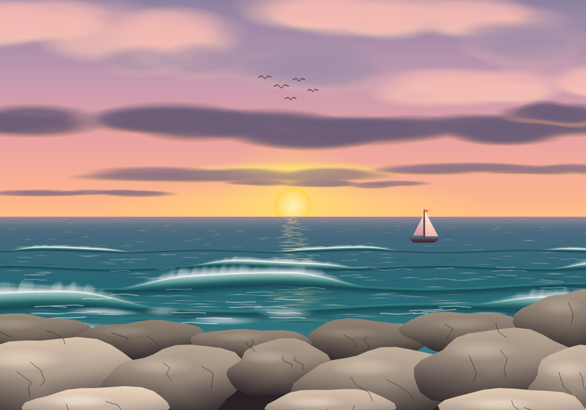

## Table of Contents

1. [Introduction](#1-introduction)
2. [Background and Sources](#2-background-and-sources)
3. [Project Description](#3-project-description)
   - [3.1 Objective](#31-objective)
   - [3.2 Problem Statement](#32-problem-statement)
   - [3.3 Scope](#33-scope)
4. [Technical Implementation](#4-technical-implementation)
   - [4.1 Tools and Technologies Used](#41-tools-and-technologies-used)
   - [4.2 Development Process](#42-development-process)
   - [4.3 Algorithms and Techniques](#43-algorithms-and-techniques)
5. [Graphics and Rendering](#5-graphics-and-rendering)
   - [5.1 2D Rendering Techniques](#51-2d-rendering-techniques)
   - [5.2 Lighting and Shading](#52-lighting-and-shading)
   - [5.3 Texturing and Animation](#53-texturing-and-animation)
6. [Testing and Evaluation](#6-testing-and-evaluation)
   - [6.1 Testing Methodology](#61-testing-methodology)
   - [6.2 Performance Evaluation](#62-performance-evaluation)
   - [6.3 Issues and Debugging](#63-issues-and-debugging)
7. [Conclusion and Future Work](#7-conclusion-and-future-work)
8. [References](#8-references)
9. [Appendix](#9-appendix)

---

## 1. Introduction

This project is the second practical work of the Computer Graphics Fundamentals
course. Its goal is a complete two-dimensional scene drawn with OpenGL that reads
as one illustration and not as a set of unrelated shapes. The chosen theme is a
sunset over a rocky seashore. The composition is based on a photograph of such a
shore and redrawn as a wide 1000 by 700 picture.

The first assignment showed that modern OpenGL can only fill triangles between
vertices that the program computes itself. This assignment uses the same data
path at a much larger scale. The scene contains about 109 thousand vertices in 29
separate objects. It also adds two things that the first work did not have:
uniform variables that change the picture from the application, and keyboard
interaction.

The expected outcome is one working program that shows the scene in a sunset
mode and a night mode. It is built with one command, and the report explains how
every object and every visual effect is made from the basic primitives.

## 2. Background and Sources

The specification of the work is the assignment brief of the course (Astana IT
University, 2026). It lists ten requirements: one window with one complete 2D
scene, at least five visible objects, all three basic primitives (`GL_POINTS`,
`GL_LINES` and `GL_TRIANGLES`), complex objects built from basic primitives,
vertex data stored in VAOs and VBOs, at least four RGB colours, colour
interpolation between the vertices of one object, a vertex and a fragment
shader, at least one uniform variable, and at least one interaction.

The theoretical background comes from the lecture material of the course. The
introductory lecture (Batkuldinova, 2026a) describes the pipeline: vertices pass
through the vertex processor, the clipper and primitive assembler, the
rasteriser and the fragment processor. It also states that vertex attributes are
interpolated across a primitive by the rasteriser. This single property produces
every gradient in the scene: the sky, the sea, the sun, the wave faces, the rocks
and the sails. The lecture on the background of OpenGL programming
(Batkuldinova, 2026b) explains retained mode. The scene follows it: all geometry
is generated once, stored on the graphics card and redrawn every frame.

The lecture on shaders (Batkuldinova, 2026c) and the lecture on GLSL in practice
(Batkuldinova, 2026d) cover the vertex and fragment stages, compiling and linking
a program object, and connecting application variables to shader inputs. This
project uses both kinds of connection from those lectures: per-vertex attributes
for positions and colours, and uniform variables for values that are the same
for a whole draw call.

The course textbook (Angel and Shreiner, 2014) is the source of the general
structure of an OpenGL program and of the parametric construction of circles
from sine and cosine.

Several normative documents were used for details. The OpenGL 3.3 core profile
specification (Khronos Group, 2010a) defines what may be used. In particular,
line widths greater than one are not guaranteed in the core profile, which
affected the design (section 4.3). The GLSL 3.30 specification (Khronos Group,
2010b) defines `layout(location = …)`, `mix`, `smoothstep` and `gl_PointCoord`,
which are used in the shaders. The signatures of `glVertexAttribPointer`,
`glBufferData`, `glDrawArrays` and `glBlendFunc` were checked in the reference
pages (Khronos Group, n.d.).

Finally, several library and tool documents were needed. The GLFW documentation
(GLFW Project, n.d.) describes window creation, context hints, keyboard callbacks
and the difference between window size and framebuffer size on high-resolution
screens. The GLAD generator (Herberth, n.d.) produced the function loader. The
CMake documentation (Kitware, n.d.) was used to write the build file. Apple's
documentation (Apple Inc., n.d.) explains that macOS supports OpenGL up to 4.1
and that a core profile context must be requested as forward-compatible. The Git
book (Chacon and Straub, 2014) was used for branching and merging.

## 3. Project Description

### 3.1 Objective

The objective is to create one complete 2D scene, "Sunset by the Sea", with the
modern OpenGL pipeline. Every object must be built from basic primitives, and the
scene must react to the user through uniform variables.

The concrete goals are the following:

- draw a sky with a gradient from warm yellow to peach, pink and lilac, with soft
  clouds and thin cloud streaks crossing the sun;
- draw a sun setting on the horizon, with a soft glow and a golden path of light
  on the water;
- draw a teal sea with ripples, rows of swells with breaking white foam, a
  sailboat and a flock of gulls;
- draw a row of boulders in the foreground with foam around them;
- provide a night mode in which the sun becomes a cratered moon, the reflection
  becomes silver, the colours cool down and stars appear;
- use all three basic primitives, VAOs and VBOs, a vertex and a fragment shader,
  and uniform variables;
- let the user switch between sunset and night, move the sun or moon and change
  the brightness from the keyboard.

### 3.2 Problem Statement

The main problem is that the scene must look like a painted illustration, while
OpenGL offers only points, lines and triangles, and the core profile draws lines
only one pixel wide. Soft clouds, foam, glowing light and irregular rocks do not
exist as primitives. Each of them has to be turned into a formula that produces
vertices, and each soft edge has to become a colour or transparency value at a
vertex.

A second problem is the day and night modes. The whole picture must change its
colours at once, without rebuilding any geometry. This requires colours that the
application can switch through a uniform variable instead of fixed colours in the
vertex data.

A third problem is the order of objects. The sun has to disappear behind the
horizon, the clouds have to cross it, and the rocks have to cover the nearest
waves. Without a depth buffer, all of this depends only on the order of the draw
calls.

### 3.3 Scope

The following is included in the implementation:

- about 109 thousand vertices generated at start-up from parametric formulas and
  a fixed-seed random number generator;
- one VAO and one VBO per object (29 in total), with three vertex attributes;
- a vertex and a fragment shader in GLSL 3.30, written as strings inside the
  program;
- per-vertex colour interpolation and per-vertex transparency;
- two colours per vertex (sunset and night), mixed by a uniform variable;
- alpha blending for soft edges, glow and reflection;
- keyboard interaction: a mode switch, a movable sun or moon and brightness
  control;
- a CMake build and a screenshot mode that renders both modes to image files.

The following is deliberately excluded:

- animation over time: the scene is a still picture that changes only in
  response to the keyboard;
- transformation matrices, rotation and scaling;
- three-dimensional geometry, projection and depth testing;
- lighting models, normals and texture mapping.

## 4. Technical Implementation

### 4.1 Tools and Technologies Used

The project is written in C++ and uses OpenGL for rendering, GLFW for the window
and the keyboard, and GLAD to load the OpenGL functions. The full environment is
given in Table 1.

***Table 1. Tools and technologies***

| Component | Value and purpose |
|---|---|
| Programming language | C++17 |
| Graphics API | OpenGL 3.3 core profile, requested explicitly (the driver provides 4.1 core, "4.1 Metal - 90.5") |
| Shading language | GLSL 3.30 (`#version 330 core`) |
| Windowing and input | GLFW 3.5.1, installed with Homebrew |
| Function loader | GLAD 0.1.36, generated with `python -m glad --profile core --api gl=3.3 --generator c --out-path glad` |
| Compiler | Apple clang 21.0.0 |
| Build system | CMake 4.4.3 (the build file requires 3.16 or newer) |
| Operating system | macOS 26.5.1 on Apple Silicon (Apple M4) |
| Editor | JetBrains IntelliJ IDEA |
| Version control | Git, with the repository hosted on GitHub |

GLFW and CMake were installed with Homebrew. GLAD is not a library that needs to
be installed: the generator produces three source files, which are stored in the
`glad` folder and compiled together with the program. The same CMake file also
builds on Linux, where GLFW is installed with `sudo apt install libglfw3-dev`.

### 4.2 Development Process

The work was done step by step, and every step ended with a program that
compiled and ran. The steps were the following.

1. **Environment.** GLFW and CMake were installed with Homebrew. Homebrew's
   Python does not allow global package installs, so `glad` was installed into a
   separate virtual environment, and the OpenGL 3.3 core loader was generated
   into the `glad` folder.
2. **Window and pipeline.** A GLFW window of 1000 by 700 with an OpenGL 3.3 core
   context was created, GLAD was loaded, and the two shaders were compiled from
   strings. On a Retina screen the framebuffer is twice the window size, so the
   viewport is taken from `glfwGetFramebufferSize`.
3. **Mesh structure.** A small `Mesh` structure was written with helpers for
   points, lines, triangles, quads and circles, and an `upload` function that
   creates the VAO and VBO. From this point every object is just a function that
   fills a `Mesh`.
4. **First composition.** The first version was a tropical beach with a palm
   tree, islands and a sandy shore. It already had every required element, but
   the scene was then redesigned from a photograph of a real seashore.
5. **Redesign from the reference photo.** The beach and the palm were replaced by
   the elements of the photograph: a pastel overcast sky, a sun on the horizon, a
   turquoise sea with breaking waves and boulders in the foreground. New
   techniques were needed for this: soft ellipses for clouds and foam, rows of
   swells, and rocks with irregular outlines (section 4.3).
6. **Composition fixes.** After each change both modes were rendered to image
   files and inspected. Two problems were found and fixed this way: the sun
   blended into the yellow horizon, and the wave rows looked like uniform
   stripes (section 6.3).
7. **Interaction.** Space was connected to the night mode, the arrow keys to the
   position of the sun, and W and S to the brightness.
8. **Static scene.** The final version is a still picture: the day and night
   switch is instant, and nothing moves by itself.
9. **Submission.** The archive was built without build files and checked by
   building it from scratch in an empty folder (section 6.1).

Git was used throughout. The history of commits records the order in which the
parts were added. Build outputs and the submission archive are excluded from the
repository with `.gitignore`.

The project was developed individually, so no division of work between team
members was required.

### 4.3 Algorithms and Techniques

Seven techniques carry the whole implementation. They are described below
together with the code that implements them.

**Scene coordinates in pixels.**

All objects are defined in pixels: (0, 0) is the bottom-left corner and
(1000, 700) is the top-right corner. The vertex shader converts pixels to
normalized device coordinates, where the window spans from −1 to 1 on both axes.
This makes round circles and exact positions easy to write.

```glsl
vec2 p = aPos + uOffset;
gl_Position = vec4(p.x / 500.0 - 1.0, p.y / 350.0 - 1.0, 0.0, 1.0);
```

**Two colours per vertex.**

Each vertex stores a position and two RGBA colours: one for sunset and one for
night. Ten floats (40 bytes) are stored one after another in one buffer, and the
attribute pointers describe this interleaved layout with a stride of 40 bytes and
offsets of 0, 8 and 24 bytes.

```cpp
struct Vertex { float x, y; Color day, night; };

glVertexAttribPointer(0, 2, GL_FLOAT, GL_FALSE, stride, (void*)offsetof(Vertex, x));
glVertexAttribPointer(1, 4, GL_FLOAT, GL_FALSE, stride, (void*)offsetof(Vertex, day));
glVertexAttribPointer(2, 4, GL_FLOAT, GL_FALSE, stride, (void*)offsetof(Vertex, night));
```

The vertex shader chooses between them with `mix(aDayColor, aNightColor, uNight)`,
so the whole scene changes mode without any change to the geometry.

**Parametric circles as triangle fans.**

A circle is a fan of thin triangles around its centre. The points on the circle
are `(cx + r·cos a, cy + r·sin a)`. The centre gets one colour and the edge
another, so the rasteriser produces a radial gradient. The sun, its glow and the
craters of the moon are made this way.

```cpp
for (int i = 0; i < seg; ++i) {
    float a0 = 2.0f * PI * i / seg, a1 = 2.0f * PI * (i + 1) / seg;
    triangle(c, {c.x + r * std::cos(a0), c.y + r * std::sin(a0)},
                {c.x + r * std::cos(a1), c.y + r * std::sin(a1)}, center, edge, edge);
}
```

**Soft ellipses.**

Clouds, foam and glow need soft edges. A soft ellipse has two layers: a solid
core up to an inner ring, and a ring of quads whose outer vertices have alpha 0.
The rasteriser interpolates the alpha, so the edge fades out smoothly.

```cpp
triangle(c, in0, in1, core, core, core);             // solid core
quad(in0, out0, out1, in1, core, edge, edge, core);  // ring fading to alpha 0
```

A cloud is a cluster of 7 to 12 such ellipses. Each puff has a lighter,
orange-pink lower part and a darker core above it, so the clouds look lit by the
setting sun from below. All lower parts are drawn first and all cores second.
The random positions come from `std::mt19937` with a fixed seed, so the picture
is the same on every run.

**Rows of swells.**

Each of the four wave rows follows a sine curve `y = Y + A·sin(k·x + φ)` and is
built from vertical strips 8 pixels wide. Each strip has four quads: a shadow in
front of the wave, the wave face going from dark teal to light turquoise, foam
spilling down the face, and a white foam cap with a ragged top. A second
function, `crest(x)`, varies along the row between 0 (calm) and 1 (breaking), so
foam appears only in some places, as in the photograph.

```cpp
auto base  = [&](float x) { return y + amp * std::sin(k * x + ph); };
auto crest = [&](float x) { return smooth01(1.2f * std::sin(k * 0.6f * x + ph * 2.3f)); };
```

**Irregular rocks.**

A rock is a triangle fan whose radius depends on the angle. Three sine terms
with random phases make every outline bumpy and different. The colour of each
vertex depends on its height, so the top of a rock is lit and the bottom is dark.
A soft highlight and two crack lines finish the rock.

```cpp
auto radius = [&](float a) {
    return 1.0f + 0.10f * std::sin(2 * a + p1) + 0.07f * std::sin(3 * a + p2)
                + 0.04f * std::sin(7 * a + p3);
};
```

**Thick lines from thin lines.**

The core profile only guarantees lines one pixel wide, and `glLineWidth` values
above one are not supported on macOS. A thick line is therefore drawn as several
parallel one-pixel lines, shifted along the normal of the segment by half a
pixel each.

```cpp
Vec2 n = {-dy / len, dx / len};
int strands = std::max(1, (int)std::lround(width * 2.0f));
for (int i = 0; i < strands; ++i) {
    float o = (i - (strands - 1) * 0.5f) * 0.5f;
    vertex({a.x + n.x * o, a.y + n.y * o}, ta);
    vertex({b.x + n.x * o, b.y + n.y * o}, tb);
}
```

## 5. Graphics and Rendering

### 5.1 2D Rendering Techniques

All rendering follows the same path. At start-up each object fills its own list
of vertices in system memory, and `upload()` copies it into its own VBO and
records the attribute layout in its own VAO. Every frame, the program sets the
uniform variables and calls `glDrawArrays` for each object. The vertex shader
converts the position, adds the offset of the object and mixes the sunset and
night colours. The rasteriser interpolates the colour across each primitive, and
the fragment shader writes it to the framebuffer.

```glsl
#version 330 core
layout(location = 0) in vec2 aPos;
layout(location = 1) in vec4 aDayColor;
layout(location = 2) in vec4 aNightColor;

uniform vec2  uOffset;
uniform float uNight;
uniform float uBrightness;
uniform float uAlpha;
uniform float uPointSize;

out vec4 vColor;

void main()
{
    vec2 p = aPos + uOffset;
    gl_Position  = vec4(p.x / 500.0 - 1.0, p.y / 350.0 - 1.0, 0.0, 1.0);
    gl_PointSize = uPointSize;

    vec4 c = mix(aDayColor, aNightColor, uNight);
    vColor = vec4(c.rgb * uBrightness, c.a * uAlpha);
}
```

The three primitives are used as follows. `GL_POINTS` draws the stars; the
fragment shader makes them round by discarding the corners of each point with
`gl_PointCoord` (Appendix 9.2). `GL_LINES` draws the path of light on the water,
the ripples, the lace of foam, the cracks in the rocks, the mast and the gulls.
`GL_TRIANGLES` draws everything else.

Uniform variables change the scene from the application:

| Uniform | What it does |
|---|---|
| `uNight` | 0 at sunset, 1 at night; selects the vertex colour with `mix` |
| `uOffset` | places an object: the sun or moon (moved with the arrow keys), the path of light under it, the clouds, the boat and the gulls |
| `uBrightness` | multiplies all colours (W and S keys) |
| `uAlpha` | makes an object transparent: the glow and the reflection fade out as the sun sets |
| `uPointSize`, `uRoundPoints` | size and round shape of the stars |

There is no depth buffer, so objects are drawn from the farthest to the nearest,
and each later object covers the earlier ones: sky, stars, sun glow, sun and
craters, clouds, a second faint pass of the glow, sea, path of light, ripples,
boat, swells, foam, rocks and gulls. The sea is drawn after the sun, so when the
sun is moved below the horizon the sea covers it.

#### Building the scene step by step

The figures below show the scene being built in a logical order: first the
background (sky and sea), then the light (sun and its reflection), then the
sky details, the water, the foreground and the small details, and finally
the night mode. Each step shows the code that builds the new object and
explains how it works.

Each image was rendered by the final program with only the objects of the
finished steps switched on. Inside a frame the objects are always drawn in
the order of `render()`, so every image looks exactly like the finished
scene without the later objects.

##### Step 1. An empty window

The first step is a window with a working OpenGL context and nothing drawn in
it. GLFW creates the window and the context. The hints ask for OpenGL 3.3 in the
core profile. `GLFW_OPENGL_FORWARD_COMPAT` is required on macOS, `GLFW_RESIZABLE`
keeps the size fixed at 1000 by 700 so the proportions never change, and
`GLFW_SAMPLES` turns on 4x anti-aliasing. `glfwSwapInterval(1)` limits the frame
rate to the refresh rate of the screen. After the context exists, GLAD loads the
addresses of all OpenGL functions from the driver; without this step the first
`gl…` call would crash.

```cpp
if (!glfwInit()) {
    std::fprintf(stderr, "Failed to initialise GLFW\n");
    return EXIT_FAILURE;
}
glfwWindowHint(GLFW_CONTEXT_VERSION_MAJOR, 3);
glfwWindowHint(GLFW_CONTEXT_VERSION_MINOR, 3);
glfwWindowHint(GLFW_OPENGL_PROFILE, GLFW_OPENGL_CORE_PROFILE);
glfwWindowHint(GLFW_OPENGL_FORWARD_COMPAT, GL_TRUE);
glfwWindowHint(GLFW_RESIZABLE, GLFW_FALSE);
glfwWindowHint(GLFW_SAMPLES, 4);

GLFWwindow* win = glfwCreateWindow(WIN_W, WIN_H, "Sunset by the Sea - OpenGL Postcard",
                                   nullptr, nullptr);
if (!win) {
    std::fprintf(stderr, "Failed to create an OpenGL 3.3 window\n");
    glfwTerminate();
    return EXIT_FAILURE;
}
glfwMakeContextCurrent(win);
glfwSwapInterval(1);
glfwSetKeyCallback(win, keyCallback);

if (!gladLoadGLLoader((GLADloadproc)glfwGetProcAddress)) {
    std::fprintf(stderr, "Failed to load OpenGL functions with GLAD\n");
    return EXIT_FAILURE;
}
```

Every frame starts with `beginFrame`. On a Retina screen the framebuffer is
2000 by 1400 pixels while the window is 1000 by 700, so the viewport is taken from
`glfwGetFramebufferSize`. The screen is then cleared to black. The returned scale
factor (2 on Retina) is used later for the size of the stars.

```cpp
auto beginFrame = [&]() -> float {
    int fbW, fbH;
    glfwGetFramebufferSize(win, &fbW, &fbH);
    glViewport(0, 0, fbW, fbH);
    glClearColor(0, 0, 0, 1);
    glClear(GL_COLOR_BUFFER_BIT);
    return (float)fbW / WIN_W;
};
```


***Figure 1.** An empty 1000 by 700 window cleared to black. The window, the context, the viewport and the clear colour work before any geometry exists.*

##### Step 2. The sky

The sky is the farthest object, so it is built and drawn first. It is a stack of
32 horizontal bands from the horizon (`y = 330`) to the top of the window. Each
band is one `quad`, that is two triangles. The colours come from the palette:
every entry is a `Tone` with a sunset colour and a night colour.

```cpp
const Tone skyHorizon = {rgb(1.00f, 0.75f, 0.52f), rgb(0.15f, 0.14f, 0.28f)};
const Tone skyPeach   = {rgb(0.99f, 0.70f, 0.56f), rgb(0.09f, 0.09f, 0.22f)};
const Tone skyPink    = {rgb(0.92f, 0.64f, 0.64f), rgb(0.05f, 0.06f, 0.16f)};
const Tone skyLilac   = {rgb(0.76f, 0.60f, 0.69f), rgb(0.03f, 0.04f, 0.11f)};
const Tone skyTop     = {rgb(0.56f, 0.51f, 0.63f), rgb(0.01f, 0.02f, 0.07f)};
```

`skyTone(t)` returns the colour at the height `t` (0 at the horizon, 1 at the
top) by blending between the four palette colours with `lerp`. The two bottom
corners of a band get the colour of its lower edge and the two top corners the
colour of its upper edge. The rasteriser interpolates between them, which turns
32 flat bands into one smooth gradient: warm yellow, peach, pink, lilac and
grey-violet.

```cpp
static Tone skyTone(float t)
{
    if (t < 0.10f) return lerp(pal::skyHorizon, pal::skyPeach, t / 0.10f);
    if (t < 0.35f) return lerp(pal::skyPeach, pal::skyPink, (t - 0.10f) / 0.25f);
    if (t < 0.65f) return lerp(pal::skyPink, pal::skyLilac, (t - 0.35f) / 0.30f);
    return lerp(pal::skyLilac, pal::skyTop, (t - 0.65f) / 0.35f);
}

static void buildSky(Mesh& m)
{
    const int bands = 32;
    for (int i = 0; i < bands; ++i) {
        float t0 = (float)i / bands, t1 = (float)(i + 1) / bands;
        float y0 = HORIZON - 2.0f + t0 * (SCENE_H - HORIZON + 2.0f);
        float y1 = HORIZON - 2.0f + t1 * (SCENE_H - HORIZON + 2.0f);
        Tone a = skyTone(t0), b = skyTone(t1);
        m.quad({0, y0}, {SCENE_W, y0}, {SCENE_W, y1}, {0, y1}, a, a, b, b);
    }
}
```

The sky is drawn with `drawMesh(s.sky);`. The lower part of the window is still
black because the sea does not exist yet.


***Figure 2.** The sky gradient made of 32 two-triangle bands. The lower part of the window is still empty.*

##### Step 3. The sea

The sea fills everything below the horizon. It is built the same way as the sky:
24 bands with a gradient. At the horizon the water reflects the sky and is
grey-violet; lower down it becomes slate blue, deep teal and finally turquoise
near the viewer. `d` is the depth below the horizon, from 0 to 1.

```cpp
const Tone seaHorizon = {rgb(0.60f, 0.54f, 0.60f), rgb(0.12f, 0.13f, 0.26f)};
const Tone seaFar     = {rgb(0.30f, 0.42f, 0.50f), rgb(0.05f, 0.08f, 0.17f)};
const Tone seaMid     = {rgb(0.15f, 0.40f, 0.45f), rgb(0.03f, 0.06f, 0.12f)};
const Tone seaNear    = {rgb(0.24f, 0.55f, 0.56f), rgb(0.05f, 0.10f, 0.16f)};

static void buildSea(Mesh& m)
{
    const int bands = 24;
    auto tone = [](float d) {
        if (d < 0.06f) return lerp(pal::seaHorizon, pal::seaFar, d / 0.06f);
        if (d < 0.35f) return lerp(pal::seaFar, pal::seaMid, (d - 0.06f) / 0.29f);
        return lerp(pal::seaMid, pal::seaNear, (d - 0.35f) / 0.65f);
    };
    for (int i = 0; i < bands; ++i) {
        float d0 = (float)i / bands, d1 = (float)(i + 1) / bands;
        float yTop = HORIZON * (1.0f - d0), yBot = HORIZON * (1.0f - d1);
        m.quad({0, yBot}, {SCENE_W, yBot}, {SCENE_W, yTop}, {0, yTop},
               tone(d1), tone(d1), tone(d0), tone(d0));
    }
}
```

With the sky and the sea the basic composition is already there: a horizon line
with a warm sky above and cool water below. Everything else is added on top of
these two objects.

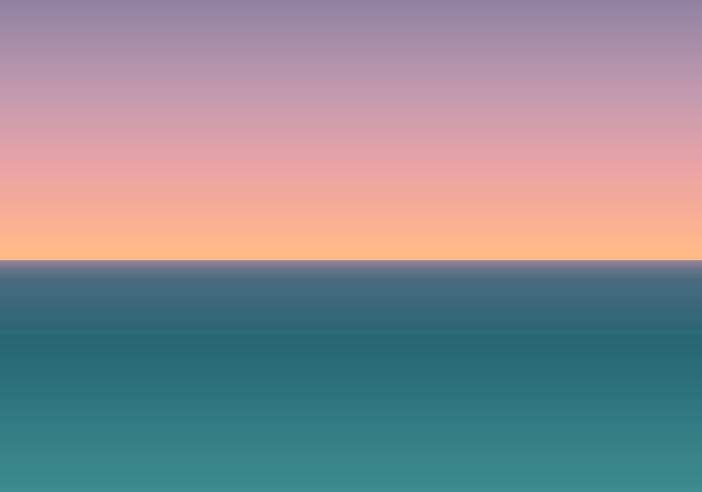

***Figure 3.** The sea: 24 bands from the grey-violet horizon to turquoise water. The sky and the sea together form the basic composition.*

##### Step 4. The sun

The sun is the main light of the picture. It is built from circles. A circle is
a fan of thin triangles around the centre; the points on the edge are
`(cx + r·cos a, cy + r·sin a)`. The centre and the edge get different colours, so
the rasteriser produces a radial gradient.

```cpp
void circle(Vec2 c, float r, const Tone& center, const Tone& edge, int seg = 48)
{
    for (int i = 0; i < seg; ++i) {
        float a0 = 2.0f * PI * i / seg, a1 = 2.0f * PI * (i + 1) / seg;
        triangle(c, {c.x + r * std::cos(a0), c.y + r * std::sin(a0)},
                    {c.x + r * std::cos(a1), c.y + r * std::sin(a1)}, center, edge, edge);
    }
}
```

`buildSun` fills three meshes. The **glow** is two wide soft ellipses (one along
the horizon and one for the bright gap in the clouds) and two circles whose
edges have alpha 0. The **disk** has an almost white centre and an orange edge.
The **craters** are for the night: their sunset colour has alpha 0, so they are
invisible now.

```cpp
static void buildSun(Mesh& glow, Mesh& disk, Mesh& craters)
{
    const Tone warm   = {rgb(1.00f, 0.86f, 0.45f, 0.70f), rgb(0.75f, 0.82f, 1.00f, 0.30f)};
    const Tone gapSun = {rgb(1.00f, 0.90f, 0.45f, 0.85f), rgb(0.75f, 0.82f, 1.00f, 0.12f)};
    glow.softEllipse({0, 0}, 330, 48, warm, fade(warm, 0), 0.15f, 64);
    glow.softEllipse({0, 58}, 210, 20, gapSun, fade(gapSun, 0), 0.3f, 48);
    glow.circle({0, 0}, SUN_R * 4.0f, warm, fade(warm, 0), 64);
    glow.circle({0, 0}, SUN_R * 1.8f, warm, fade(warm, 0), 64);

    const Tone center = {rgb(1.00f, 1.00f, 0.90f), rgb(0.98f, 0.98f, 0.94f)};
    const Tone edge   = {rgb(1.00f, 0.80f, 0.28f), rgb(0.80f, 0.83f, 0.90f)};
    disk.circle({0, 0}, SUN_R, center, edge, 64);

    const Tone crater = {rgb(1.0f, 0.8f, 0.5f, 0.0f), rgb(0.66f, 0.69f, 0.76f, 0.6f)};
    const Tone rim    = {rgb(1.0f, 0.8f, 0.5f, 0.0f), rgb(0.74f, 0.77f, 0.84f, 0.2f)};
    craters.circle({-10, 8}, 8, crater, rim, 24);
    craters.circle({11, -6}, 6, crater, rim, 24);
    craters.circle({-4, -14}, 4, crater, rim, 20);
    craters.circle({14, 12}, 3, crater, rim, 16);
}
```

The sun is built around the point (0, 0). The uniform `uOffset` moves it to its
position `(sunX, sunY)`, so the same geometry can later be moved with the arrow
keys. The glow fades out through `uAlpha` when the sun sinks.

```cpp
const float glowA = smooth01((g.sunY - (HORIZON - 1.5f * SUN_R)) / (2.5f * SUN_R));
const float reflA = smooth01((g.sunY - (HORIZON - SUN_R)) / (1.5f * SUN_R));
drawMesh(s.sunGlow, g.sunX, g.sunY, glowA);
drawMesh(s.sun, g.sunX, g.sunY);
drawMesh(s.moonCraters, g.sunX, g.sunY);
```

The sun is drawn **before** the sea. The sea covers its lower half, so the sun
looks as if it is setting behind the horizon. This is the painter's algorithm:
there is no depth buffer, and the object drawn later is on top.

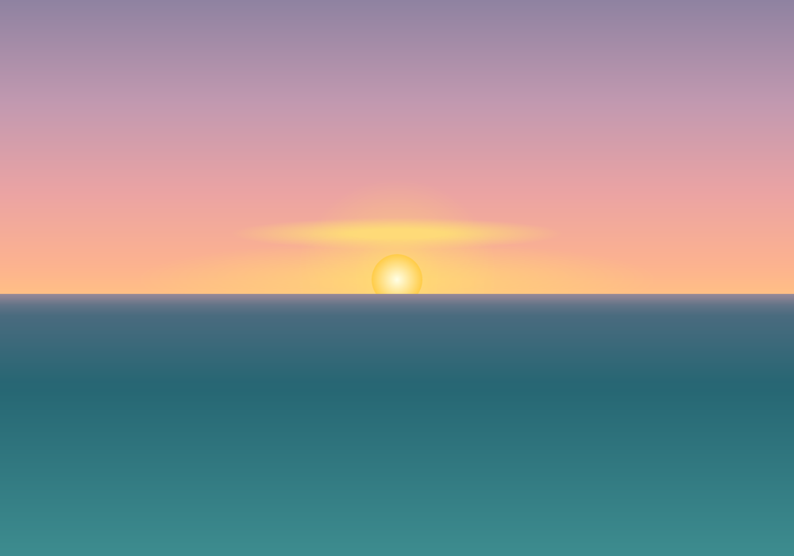

***Figure 4.** The sun on the horizon with its glow. The sea is drawn after the sun and hides its lower half.*

##### Step 5. The path of light on the water

Under a low sun the sea shows a bright path of light. It is drawn with
`GL_LINES`. A line in the core profile is only one pixel wide, and `glLineWidth`
values above one are not supported on macOS. `Mesh::line` therefore draws a
thicker line as several parallel one-pixel lines, shifted along the normal
`n = (-dy, dx) / len` by half a pixel each.

```cpp
void line(Vec2 a, Vec2 b, const Tone& ta, const Tone& tb, float width = 1.0f)
{
    float dx = b.x - a.x, dy = b.y - a.y;
    float len = std::sqrt(dx * dx + dy * dy);
    if (len < 1e-4f) return;
    Vec2 n = {-dy / len, dx / len};
    int strands = std::max(1, (int)std::lround(width * 2.0f));
    for (int i = 0; i < strands; ++i) {
        float o = (i - (strands - 1) * 0.5f) * 0.5f;
        vertex({a.x + n.x * o, a.y + n.y * o}, ta);
        vertex({b.x + n.x * o, b.y + n.y * o}, tb);
    }
}
```

`buildSunPath` goes down from the horizon in rows 2.5 pixels apart. The path gets
wider toward the viewer (`halfW` grows with the depth `d`) and weaker (`fade`).
Each row has 2 to 4 dashes at random positions. Every dash is two lines from a
transparent end to a bright middle, so the dashes have soft ends. The random
generator uses a fixed seed, so the picture is the same on every run.

```cpp
static void buildSunPath(Mesh& m)
{
    const Tone gold = {rgb(1.00f, 0.86f, 0.60f, 0.80f), rgb(0.88f, 0.92f, 1.00f, 0.85f)};
    std::mt19937 rng(3);
    std::uniform_real_distribution<float> r01(0.0f, 1.0f);
    for (float y = HORIZON - 2.0f; y > 150.0f; y -= 2.5f) {
        float d = (HORIZON - y) / (HORIZON - 150.0f);
        float halfW = 18.0f + 80.0f * d;
        Tone t = fade(gold, 1.0f - 0.6f * d);
        int dashes = 2 + (int)(r01(rng) * 3.0f);
        for (int i = 0; i < dashes; ++i) {
            float c = (r01(rng) * 2.0f - 1.0f) * halfW * (0.3f + 0.7f * r01(rng));
            float len = halfW * (0.15f + 0.45f * r01(rng)) * (1.0f - std::fabs(c) / halfW * 0.6f);
            float k = 1.0f - std::fabs(c) / halfW;
            Tone mid = fade(t, 0.35f + 0.65f * k);
            m.line({c - len, y}, {c, y}, fade(mid, 0.0f), mid, 1.0f);
            m.line({c, y}, {c + len, y}, mid, fade(mid, 0.0f), 1.0f);
        }
    }
}
```

The path is built around `x = 0` and drawn with the offset `(sunX, 0)`, so it
always stays under the sun. Its transparency `reflA` depends on the height of
the sun (section 5.2).

```cpp
if (reflA > 0.01f) drawMesh(s.sunPath, g.sunX, 0, reflA);
```

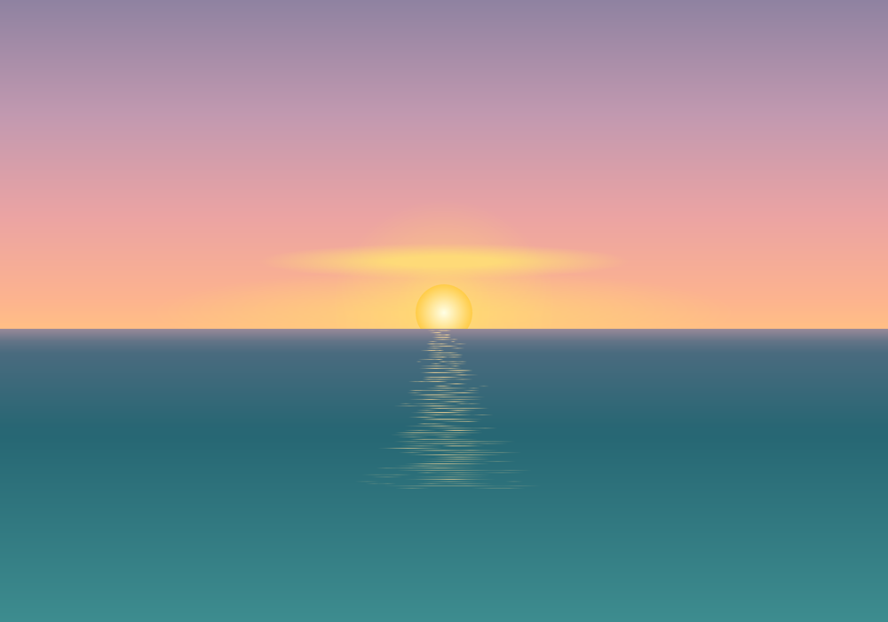

***Figure 5.** The golden path of light: rows of short lines under the sun, wider and weaker toward the viewer.*

##### Step 6. The clouds

The clouds make the sky look like the reference photo. Clouds have soft edges,
which a plain triangle fan cannot give. A **soft ellipse** solves this: it has a
solid core up to an inner ring and a ring of quads whose outer vertices have
alpha 0. The rasteriser interpolates the alpha, so the edge fades out.

```cpp
void softEllipse(Vec2 c, float rx, float ry, const Tone& core, const Tone& edge,
                 float inner = 0.5f, int seg = 36)
{
    for (int i = 0; i < seg; ++i) {
        float a0 = 2.0f * PI * i / seg, a1 = 2.0f * PI * (i + 1) / seg;
        Vec2 d0 = {rx * std::cos(a0), ry * std::sin(a0)};
        Vec2 d1 = {rx * std::cos(a1), ry * std::sin(a1)};
        Vec2 in0 = {c.x + d0.x * inner, c.y + d0.y * inner};
        Vec2 in1 = {c.x + d1.x * inner, c.y + d1.y * inner};
        Vec2 out0 = {c.x + d0.x, c.y + d0.y}, out1 = {c.x + d1.x, c.y + d1.y};
        triangle(c, in0, in1, core, core, core);
        quad(in0, out0, out1, in1, core, edge, edge, core);
    }
}
```

One cloud is a cluster of 7 to 12 soft ellipses ("puffs") at random positions.
Each puff has two ellipses: a lighter orange-pink one slightly lower (the part
lit by the sun from below) and a darker core above it. All lit parts are drawn
first and all cores second, so the cores never cover the lit parts of other
puffs.

```cpp
struct Cloud {
    Mesh mesh;
    float x, y;
};

static Cloud makeCloud(std::mt19937& rng, const CloudStyle& st, float x, float y,
                       float width, float thick, int puffs)
{
    Cloud c{Mesh(GL_TRIANGLES), x, y};
    std::uniform_real_distribution<float> r01(0.0f, 1.0f);
    struct Puff { float x, y, rx, ry; };
    std::vector<Puff> list;
    for (int i = 0; i < puffs; ++i)
        list.push_back({(r01(rng) - 0.5f) * width, (r01(rng) - 0.5f) * thick * 0.6f,
                        width * (0.15f + 0.15f * r01(rng)), thick * (0.4f + 0.3f * r01(rng))});
    for (const Puff& p : list)
        c.mesh.softEllipse({p.x, p.y - p.ry * 0.4f}, p.rx * 0.9f, p.ry * 0.7f, st.lit, fade(st.lit, 0));
    for (const Puff& p : list)
        c.mesh.softEllipse({p.x, p.y}, p.rx, p.ry, st.core, fade(st.core, 0));
    return c;
}
```

`buildClouds` defines four styles (pink overcast, lilac patches, a long dark
band and thin streaks near the horizon) and places 12 clusters: 8 behind the sun
and 4 thin streaks in front of it.

```cpp
static void buildClouds(std::vector<Cloud>& back, std::vector<Cloud>& front)
{
    const CloudStyle pink   = {{rgb(0.95f, 0.72f, 0.70f, 0.55f), rgb(0.14f, 0.14f, 0.24f, 0.55f)},
                               {rgb(1.00f, 0.84f, 0.72f, 0.45f), rgb(0.22f, 0.24f, 0.36f, 0.35f)}};
    const CloudStyle lilac  = {{rgb(0.64f, 0.56f, 0.66f, 0.60f), rgb(0.09f, 0.09f, 0.17f, 0.65f)},
                               {rgb(0.96f, 0.74f, 0.70f, 0.40f), rgb(0.20f, 0.22f, 0.34f, 0.30f)}};
    const CloudStyle dark   = {{rgb(0.43f, 0.37f, 0.47f, 0.85f), rgb(0.05f, 0.05f, 0.11f, 0.85f)},
                               {rgb(0.98f, 0.66f, 0.52f, 0.70f), rgb(0.26f, 0.28f, 0.40f, 0.45f)}};
    const CloudStyle streak = {{rgb(0.58f, 0.46f, 0.52f, 0.80f), rgb(0.07f, 0.07f, 0.14f, 0.80f)},
                               {rgb(1.00f, 0.74f, 0.42f, 0.75f), rgb(0.28f, 0.30f, 0.44f, 0.45f)}};
    std::mt19937 rng(21);

    back.push_back(makeCloud(rng, pink,   174, 655, 460, 80, 10));
    back.push_back(makeCloud(rng, pink,   644, 675, 500, 60, 10));
    back.push_back(makeCloud(rng, lilac,  984, 625, 380, 70,  9));
    back.push_back(makeCloud(rng, lilac,  390, 590, 450, 55, 10));
    back.push_back(makeCloud(rng, pink,   850, 560, 420, 50,  9));
    back.push_back(makeCloud(rng, dark,   236, 490, 520, 45, 12));
    back.push_back(makeCloud(rng, dark,   736, 475, 560, 40, 12));
    back.push_back(makeCloud(rng, dark,  1056, 505, 300, 35,  8));

    front.push_back(makeCloud(rng, streak, 348, 402, 460, 18, 10));
    front.push_back(makeCloud(rng, streak, 878, 412, 380, 16,  9));
    front.push_back(makeCloud(rng, streak, 574, 386, 300, 10,  8));
    front.push_back(makeCloud(rng, streak, 144, 372, 260, 10,  7));
}
```

The back clouds and the front streaks are drawn after the sun, so they cover it.
Then the glow is drawn a second time at a quarter of its strength, which makes
the clouds near the sun look lit from behind.

```cpp
for (const Cloud& c : s.cloudsBack) drawMesh(c.mesh, c.x, c.y);
for (const Cloud& c : s.cloudsFront) drawMesh(c.mesh, c.x, c.y);
drawMesh(s.sunGlow, g.sunX, g.sunY, 0.25f * glowA);
```

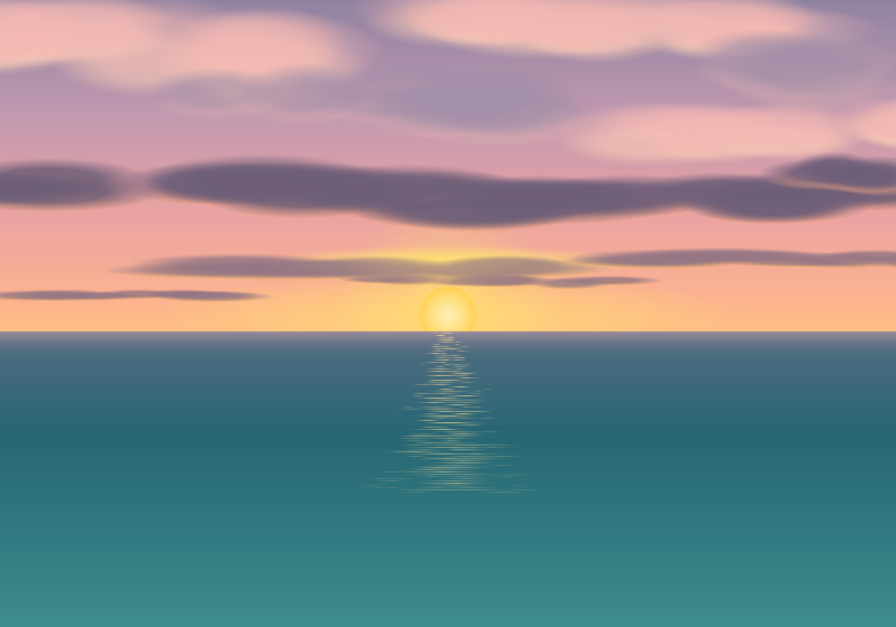

***Figure 6.** Soft clouds: pink overcast, lilac patches, a long dark band and thin streaks crossing the sun.*

##### Step 7. Ripples

A flat gradient does not look like water. The ripples give the sea a texture.
They are 320 short lines of three kinds: white caps, pink reflections of the sky
and dark troughs. Each ripple is two lines from a transparent end to a visible
middle. Ripples closer to the viewer are longer and more visible, which gives
the sea perspective.

```cpp
static void buildWaves(Mesh& m)
{
    const Tone whitecap = {rgb(0.86f, 0.90f, 0.92f, 0.55f), rgb(0.45f, 0.52f, 0.72f, 0.40f)};
    const Tone sheen    = {rgb(1.00f, 0.78f, 0.72f, 0.45f), rgb(0.30f, 0.35f, 0.55f, 0.30f)};
    const Tone trough   = {rgb(0.08f, 0.26f, 0.32f, 0.55f), rgb(0.01f, 0.03f, 0.07f, 0.50f)};
    std::mt19937 rng(11);
    std::uniform_real_distribution<float> rx(0.0f, SCENE_W), ry(150.0f, HORIZON - 3.0f);
    for (int i = 0; i < 320; ++i) {
        float x = rx(rng), y = ry(rng);
        float d = (HORIZON - y) / (HORIZON - 150.0f);
        float len = 4.0f + 30.0f * d;
        Tone t = (i % 3 == 0) ? whitecap : (i % 3 == 1) ? trough : sheen;
        t = fade(t, 0.5f + 0.5f * d);
        float w = d > 0.5f ? 1.5f : 1.0f;
        m.line({x - len, y}, {x, y + 1.0f}, fade(t, 0.0f), t, w);
        m.line({x, y + 1.0f}, {x + len, y}, t, fade(t, 0.0f), w);
    }
}
```

The ripples are drawn with `drawMesh(s.waves);` right after the path of light.

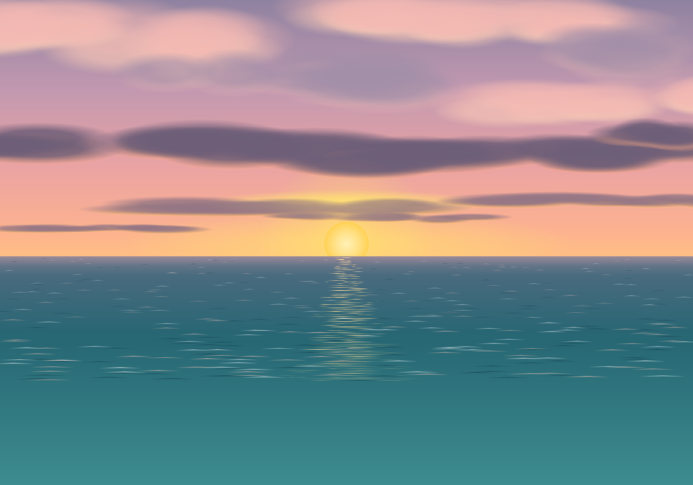

***Figure 7.** Ripples: white caps, pink sky reflections and dark troughs, longer and stronger toward the viewer.*

##### Step 8. Swells with breaking foam

The reference photo has rows of waves breaking into white foam. There are four
rows, from the far one to the near one. The table `specs` holds the height of the
row, its amplitude, the height of the wave face and of the foam, the wave number
and the phase. The row follows the curve `y = Y + A·sin(k·x + φ)`.

A second function, `crest(x)`, goes from 0 (calm water) to 1 (a breaking crest)
along the row, so foam appears only in some places. The row is built from
vertical strips 8 pixels wide, and every strip has four quads:

1. a soft shadow in front of the wave;
2. the wave face, dark teal at the bottom and light turquoise under the crest,
   which looks like light shining through the water;
3. foam spilling down the face where the wave breaks;
4. a white foam cap whose top edge is ragged because of the random `jag`.

```cpp
static void buildSwells(Mesh& m)
{
    const Tone trough = {rgb(0.08f, 0.27f, 0.31f), rgb(0.02f, 0.04f, 0.09f)};
    const Tone face   = {rgb(0.30f, 0.66f, 0.60f), rgb(0.07f, 0.15f, 0.22f)};
    const float specs[][6] = {{272, 2.0f, 6, 4, 0.023f, 0.0f},
                              {242, 3.0f, 11, 8, 0.017f, 1.3f},
                              {205, 5.0f, 22, 18, 0.012f, 2.1f},
                              {168, 6.0f, 26, 22, 0.010f, 0.7f}};
    std::mt19937 rng(5);
    std::uniform_real_distribution<float> r01(0.0f, 1.0f);
    for (int i = 0; i < 4; ++i) {
        const float y = specs[i][0], amp = specs[i][1], faceH = specs[i][2], foamH = specs[i][3];
        const float k = specs[i][4], ph = specs[i][5];
        auto base  = [&](float x) { return y + amp * std::sin(k * x + ph); };
        auto crest = [&](float x) { return smooth01(1.2f * std::sin(k * 0.6f * x + ph * 2.3f)); };

        const float step = 8.0f;
        float jag0 = r01(rng);
        for (float x = -80.0f; x < SCENE_W + 80.0f; x += step) {
            float x1 = x + step, jag1 = r01(rng);
            float b0 = base(x), b1 = base(x1), c0 = crest(x), c1 = crest(x1);
            float t0 = b0 + faceH * (0.2f + 0.8f * c0), t1 = b1 + faceH * (0.2f + 0.8f * c1);
            m.quad({x, b0 - faceH * 0.5f}, {x1, b1 - faceH * 0.5f}, {x1, b1}, {x, b0},
                   fade(trough, 0), fade(trough, 0), fade(trough, 0.9f), fade(trough, 0.9f));
            m.quad({x, b0}, {x1, b1}, {x1, t1}, {x, t0}, fade(trough, 0.9f), fade(trough, 0.9f),
                   fade(face, 0.3f + 0.7f * c1), fade(face, 0.3f + 0.7f * c0));
            m.quad({x, t0 - faceH * 0.7f * c0}, {x1, t1 - faceH * 0.7f * c1}, {x1, t1}, {x, t0},
                   fade(pal::foam, 0), fade(pal::foam, 0), fade(pal::foam, 0.6f * c1), fade(pal::foam, 0.6f * c0));
            float f0 = foamH * c0 * (0.5f + 0.5f * jag0), f1 = foamH * c1 * (0.5f + 0.5f * jag1);
            m.quad({x, t0 - 2.0f}, {x1, t1 - 2.0f}, {x1, t1 + f1}, {x, t0 + f0},
                   fade(pal::foam, 0.95f * c0), fade(pal::foam, 0.95f * c1), fade(pal::foam, 0), fade(pal::foam, 0));
            jag0 = jag1;
        }
    }
}
```

The sine here only gives the **shape** of the waves. The waves do not move.

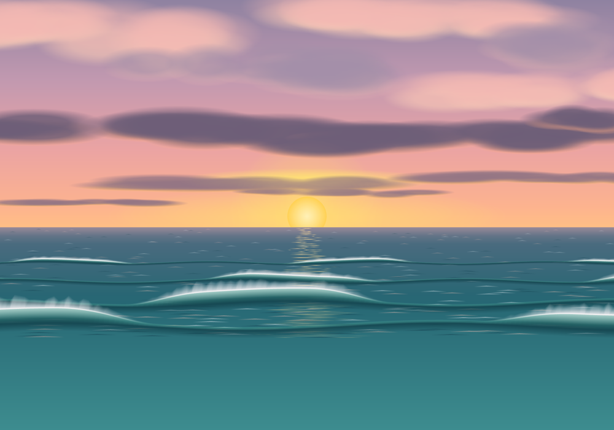

***Figure 8.** Four rows of swells with turquoise faces and white foam where the crests break.*

##### Step 9. Rocks

The foreground of the photo is a row of boulders. A rock is a triangle fan like a
circle, but its radius depends on the angle. Three sine terms with random phases
`p1`, `p2`, `p3` make every outline bumpy and different. The colour of each
vertex depends on its height (`toneAt`), so the top of a rock is lit and the
bottom is dark. A soft light ellipse on top is the highlight, and two broken
lines (`GL_LINES`) are the cracks. `shade` makes a rock lighter or darker.

```cpp
static Tone shade(Tone t, float k)
{
    for (Color* c : {&t.day, &t.night}) {
        c->r = std::min(1.0f, c->r * k);
        c->g = std::min(1.0f, c->g * k);
        c->b = std::min(1.0f, c->b * k);
    }
    return t;
}

static void addRock(Mesh& m, Mesh& cracks, std::mt19937& rng, Vec2 c, float rx, float ry, float light)
{
    const Tone lit    = shade({rgb(0.80f, 0.72f, 0.64f), rgb(0.30f, 0.32f, 0.40f)}, light);
    const Tone shadow = shade({rgb(0.22f, 0.19f, 0.20f), rgb(0.05f, 0.05f, 0.08f)}, light);
    std::uniform_real_distribution<float> r01(0.0f, 1.0f);
    const float p1 = r01(rng) * 2 * PI, p2 = r01(rng) * 2 * PI, p3 = r01(rng) * 2 * PI;

    auto radius = [&](float a) {
        return 1.0f + 0.10f * std::sin(2 * a + p1) + 0.07f * std::sin(3 * a + p2) + 0.04f * std::sin(7 * a + p3);
    };
    auto toneAt = [&](float y) { return lerp(shadow, lit, smooth01((y - (c.y - ry)) / (2.0f * ry))); };
    const int seg = 32;
    for (int i = 0; i < seg; ++i) {
        float a0 = 2.0f * PI * i / seg, a1 = 2.0f * PI * (i + 1) / seg;
        Vec2 q0 = {c.x + rx * radius(a0) * std::cos(a0), c.y + ry * radius(a0) * std::sin(a0)};
        Vec2 q1 = {c.x + rx * radius(a1) * std::cos(a1), c.y + ry * radius(a1) * std::sin(a1)};
        m.triangle(c, q0, q1, toneAt(c.y + 0.3f * ry), toneAt(q0.y), toneAt(q1.y));
    }
    const Tone shine = shade({rgb(0.96f, 0.88f, 0.80f, 0.40f), rgb(0.45f, 0.48f, 0.58f, 0.25f)}, light);
    m.softEllipse({c.x - rx * 0.2f, c.y + ry * 0.45f}, rx * 0.5f, ry * 0.28f, shine, fade(shine, 0), 0.3f, 24);

    const Tone crack = {rgb(0.18f, 0.15f, 0.16f, 0.7f), rgb(0.02f, 0.02f, 0.04f, 0.7f)};
    for (int k = 0; k < 2; ++k) {
        Vec2 a = {c.x + (r01(rng) - 0.5f) * rx, c.y + ry * (0.1f + 0.5f * r01(rng))};
        for (int s = 0; s < 3; ++s) {
            Vec2 b = {a.x + (r01(rng) - 0.3f) * rx * 0.25f, a.y - ry * (0.12f + 0.15f * r01(rng))};
            cracks.line(a, b, crack, crack, 1.0f);
            a = b;
        }
    }
}
```

`buildRocks` first draws a dark base, so the gaps between the rocks look like
shadowed crevices. Then it adds six rocks in the back row (darker) and nine in the
front row (lighter and bigger).

```cpp
static void buildRocks(Mesh& m, Mesh& cracks)
{
    const Tone deep = {rgb(0.16f, 0.13f, 0.14f), rgb(0.03f, 0.03f, 0.05f)};
    m.quad({0, 0}, {SCENE_W, 0}, {SCENE_W, 85}, {0, 85}, deep, deep, deep, deep);

    const float rocks[][5] = {
        {40, 128, 110, 40, 0.75f},  {235, 118, 105, 36, 0.70f}, {430, 110, 95, 32, 0.75f},
        {620, 115, 110, 36, 0.70f}, {810, 128, 115, 42, 0.75f}, {975, 150, 85, 58, 0.80f},
        {70, 55, 150, 70, 1.05f},   {300, 48, 120, 60, 0.90f},  {480, 70, 95, 45, 0.85f},
        {650, 45, 130, 62, 0.95f},  {850, 72, 135, 66, 0.90f},  {990, 40, 95, 65, 1.00f},
        {160, -5, 125, 45, 1.15f},  {560, -5, 115, 40, 1.05f},  {880, -10, 135, 45, 1.10f}};
    std::mt19937 rng(17);
    for (const auto& r : rocks) addRock(m, cracks, rng, {r[0], r[1]}, r[2], r[3], r[4]);
}
```

The rocks are drawn after the waves, so they cover the nearest part of the sea.

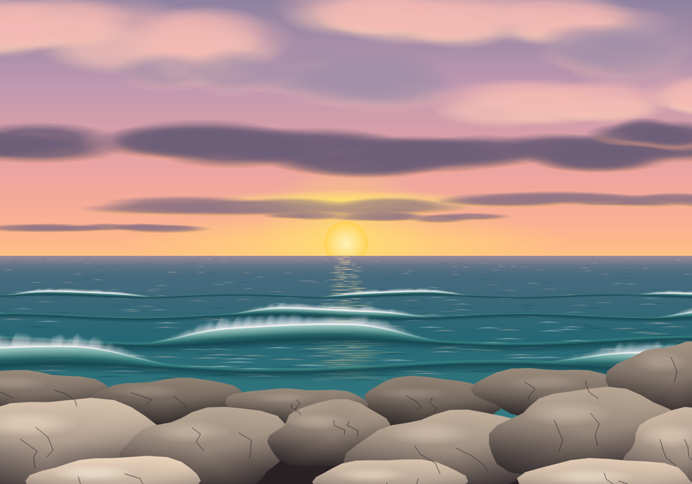

***Figure 9.** The boulders in the foreground: bumpy triangle fans, lit on top, with highlights and cracks.*

##### Step 10. Foam around the rocks

Where the waves reach the rocks, the water is white with foam. `buildWash` makes
28 soft white patches (flat soft ellipses, triangles) and 70 lacy foam lines
(short wavy broken lines, `GL_LINES`). Lines closer to the viewer are longer and
brighter.

```cpp
static void buildWash(Mesh& patches, Mesh& lace)
{
    std::mt19937 rng(9);
    std::uniform_real_distribution<float> r01(0.0f, 1.0f);
    for (int i = 0; i < 28; ++i) {
        Vec2 c = {-40.0f + r01(rng) * (SCENE_W + 80.0f), 120.0f + r01(rng) * 55.0f};
        Tone t = fade(pal::foam, 0.3f + 0.3f * r01(rng));
        patches.softEllipse(c, 30.0f + 60.0f * r01(rng), 4.0f + 5.0f * r01(rng), t, fade(t, 0), 0.25f, 28);
    }
    for (int i = 0; i < 70; ++i) {
        Vec2 a = {r01(rng) * SCENE_W, 130.0f + r01(rng) * 140.0f};
        float d = (270.0f - a.y) / 140.0f;
        Tone t = fade(pal::foam, 0.3f + 0.35f * d);
        for (int s = 0; s < 4; ++s) {
            Vec2 b = {a.x + 6.0f + 12.0f * d, a.y + (r01(rng) - 0.5f) * 3.0f};
            lace.line(a, b, t, t, d > 0.5f ? 1.5f : 1.0f);
            a = b;
        }
    }
}
```

The foam is drawn **before** the rocks, so the rocks cover part of it and the
foam looks like it is washing around them.

```cpp
drawMesh(s.foam);
drawMesh(s.wash);
drawMesh(s.rocks);
drawMesh(s.rockCracks);
```

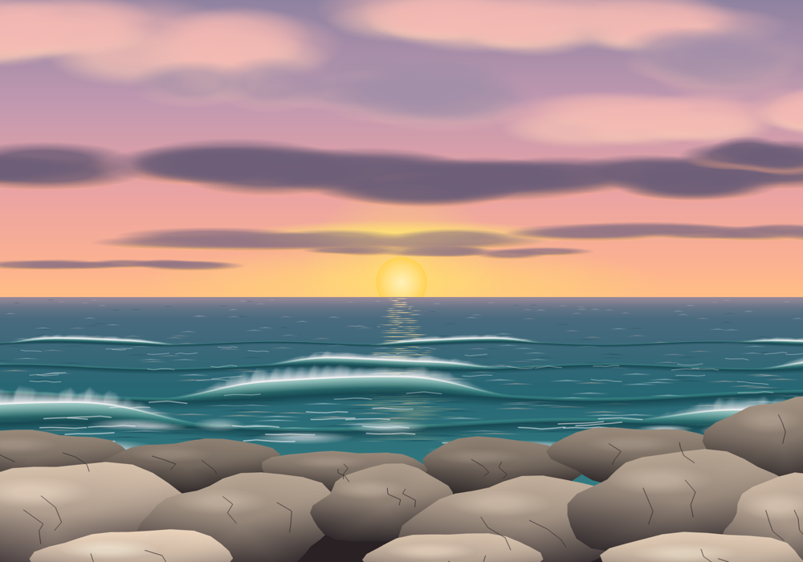

***Figure 10.** Foam around the rocks: soft white patches and lacy foam lines between the waves and the boulders.*

##### Step 11. The sailboat

A small sailboat near the horizon adds a point of interest. The parameter `s`
scales the whole boat; with `s = 0.6` it looks far away. The hull is a trapezoid
(`quad`), wider at the top. The two sails are triangles with a light top vertex
and pinker bottom vertices, so each sail has a gradient. The mast and the flag
are lines in a separate mesh `boatRig`, because one mesh has only one primitive
type.

```cpp
static void buildBoat(Mesh& body, Mesh& rig, float s)
{
    const Tone hullTop = {rgb(0.40f, 0.26f, 0.28f), rgb(0.10f, 0.09f, 0.15f)};
    const Tone hullBot = {rgb(0.20f, 0.13f, 0.17f), rgb(0.04f, 0.04f, 0.08f)};
    body.quad({-30 * s, 0}, {28 * s, 0}, {44 * s, 12 * s}, {-44 * s, 12 * s}, hullBot, hullBot, hullTop, hullTop);

    const Tone sailTop  = {rgb(1.00f, 0.95f, 0.86f), rgb(0.70f, 0.73f, 0.84f)};
    const Tone sailBase = {rgb(0.96f, 0.70f, 0.66f), rgb(0.36f, 0.39f, 0.52f)};
    const Tone jibTop   = {rgb(0.98f, 0.84f, 0.80f), rgb(0.60f, 0.63f, 0.75f)};
    const Tone jibBase  = {rgb(0.82f, 0.56f, 0.60f), rgb(0.30f, 0.33f, 0.45f)};
    body.triangle({3 * s, 18 * s}, {3 * s, 88 * s}, {40 * s, 18 * s}, sailBase, sailTop, sailBase);
    body.triangle({-3 * s, 20 * s}, {-3 * s, 76 * s}, {-32 * s, 20 * s}, jibBase, jibTop, jibBase);

    const Tone mast = {rgb(0.30f, 0.20f, 0.22f), rgb(0.06f, 0.06f, 0.10f)};
    const Tone flag = {rgb(0.90f, 0.30f, 0.32f), rgb(0.25f, 0.20f, 0.30f)};
    rig.line({0, 12 * s}, {0, 94 * s}, mast, mast, 1.5f);
    rig.line({0, 94 * s}, {12 * s, 90 * s}, flag, flag, 1.5f);
    rig.line({12 * s, 90 * s}, {0, 87 * s}, flag, flag, 1.5f);
}
```

Both meshes are drawn with the same offset, so they stay together. The boat is
drawn before the swells because it is farther away.

```cpp
drawMesh(s.boat, 724, 286);
drawMesh(s.boatRig, 724, 286);
```

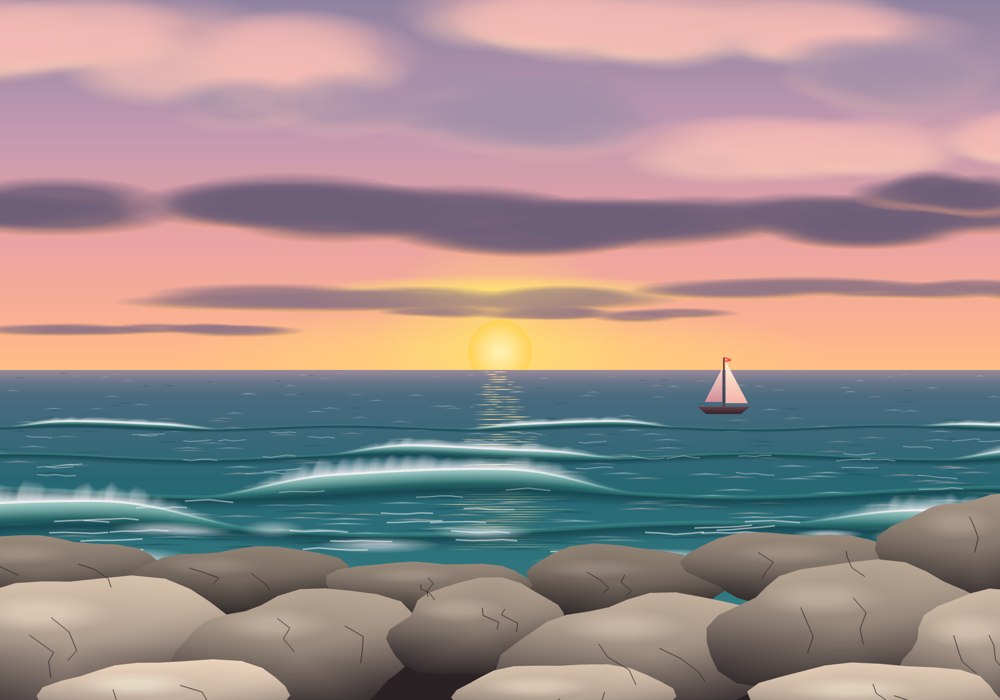

***Figure 11.** The sailboat near the horizon: a trapezoid hull, two triangular sails and a mast drawn with lines.*

##### Step 12. The gulls

A flock of five gulls finishes the sunset picture. Each gull is four line
segments in an "M" shape: two for the left wing and two for the right wing. The
third number of each bird is its size.

```cpp
static void buildBirds(Mesh& m)
{
    const float birds[][3] = {{0, 0, 1.0f}, {30, 12, 0.8f}, {-28, 16, 0.85f},
                              {54, -6, 0.7f}, {16, -20, 0.75f}};
    for (const auto& b : birds) {
        float x = b[0], y = b[1], s = b[2];
        Vec2 L = {x - 13 * s, y + 3 * s}, LM = {x - 6 * s, y + 6 * s}, C = {x, y};
        Vec2 RM = {x + 6 * s, y + 6 * s}, R = {x + 13 * s, y + 3 * s};
        m.line(L, LM, pal::silhouette, pal::silhouette, 1.5f);
        m.line(LM, C, pal::silhouette, pal::silhouette, 1.5f);
        m.line(C, RM, pal::silhouette, pal::silhouette, 1.5f);
        m.line(RM, R, pal::silhouette, pal::silhouette, 1.5f);
    }
}
```

The gulls are drawn last, on top of everything, with `drawMesh(s.birds, 480, 550);`.
This is the finished scene in sunset mode.

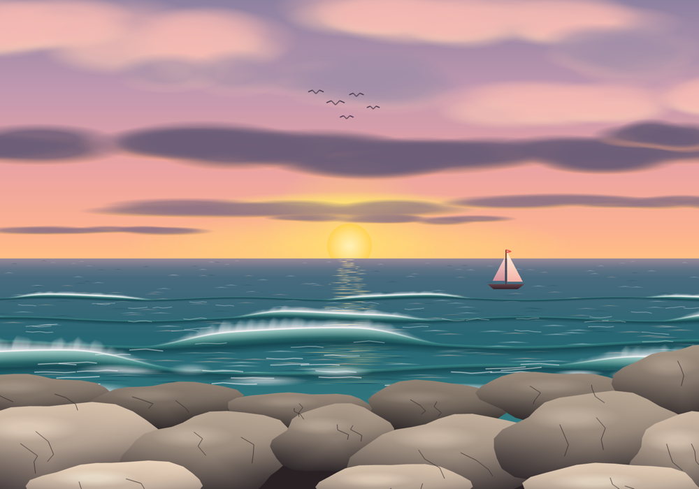

***Figure 12.** The gulls, four line segments each. The sunset scene is complete.*

##### Step 13. Night mode and stars

The last step adds the night. Nothing is rebuilt: every vertex already has a
night colour next to its sunset colour. The vertex shader picks one of them with
`mix`:

```glsl
vec4 c = mix(aDayColor, aNightColor, uNight);
```

Space toggles `g.night`, and `render()` sends 0 or 1 to `uNight`, so the switch is
instant.

```cpp
static void keyCallback(GLFWwindow* win, int key, int, int action, int)
{
    if (action != GLFW_PRESS) return;
    if (key == GLFW_KEY_ESCAPE) glfwSetWindowShouldClose(win, GLFW_TRUE);
    if (key == GLFW_KEY_SPACE) g.night = !g.night;
    if (key == GLFW_KEY_P) g.screenshotRequested = true;
}

glUniform1f(U.night, g.night ? 1.0f : 0.0f);
```

The stars are the only `GL_POINTS` in the scene. `buildStars` scatters 190 points
over the upper sky with a fixed seed; every fifth star goes into the mesh of
bigger stars. Stars near the horizon are fainter.

```cpp
static void buildStars(Mesh& small, Mesh& big)
{
    std::mt19937 rng(7);
    std::uniform_real_distribution<float> rx(0.0f, SCENE_W), ry(HORIZON + 40.0f, SCENE_H), rc(0.0f, 1.0f);
    for (int i = 0; i < 190; ++i) {
        Vec2 p = {rx(rng), ry(rng)};
        Color c = lerp(rgb(0.80f, 0.87f, 1.0f), rgb(1.0f, 0.95f, 0.80f), rc(rng));
        c.a = 0.55f + 0.45f * (p.y - HORIZON) / (SCENE_H - HORIZON);
        (i % 5 == 0 ? big : small).point(p, {c, c});
    }
}
```

Stars are drawn only at night, right after the sky, so the moon and the clouds
cover them. A point is drawn as a square; `uRoundPoints` tells the fragment
shader to cut off the corners with `gl_PointCoord` and fade the edge, so the
stars are round and soft (Appendix 9.2).

```cpp
if (g.night) {
    glUniform1i(U.roundPoints, 1);
    glUniform1f(U.pointSize, 2.5f * pixelScale);
    drawMesh(s.stars);
    glUniform1f(U.pointSize, 4.0f * pixelScale);
    drawMesh(s.bigStars, 0, 0, 0.9f);
    glUniform1i(U.roundPoints, 0);
}
```

At night the sun becomes a pale moon, and its craters (alpha 0 at sunset) become
visible. The path of light turns silver, the sea navy, the foam and the sails
silver-blue, and the clouds dark. The stars shine faintly through the
semi-transparent clouds.

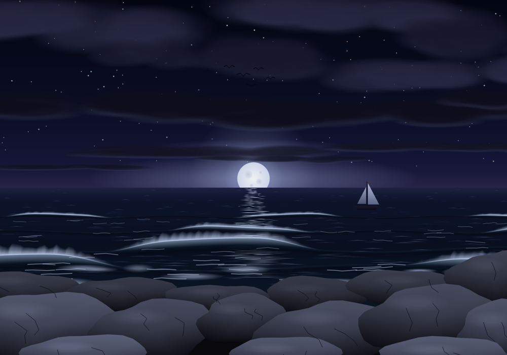

***Figure 13.** Night mode after pressing Space: night colours, the moon with craters, a silver path of light and stars.*

#### How the picture is made of primitives

Drawing the same scene with `glPolygonMode(GL_FRONT_AND_BACK, GL_LINE)` shows
the edge of every triangle instead of filling it. The triangle fans of the sun,
the clouds, the foam patches and the rocks, the bands of the sky and the sea,
and the strips of the wave rows are clearly visible.

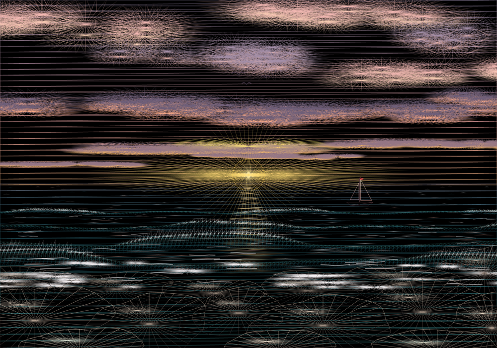

***Figure 14.** The finished scene drawn as a wireframe.*

#### Interaction

Interaction is handled in two ways. Single presses (Space, P, Esc) go through
the GLFW key callback shown in step 13. Held keys (the arrows and W, S) are
checked every frame in `update()` with `glfwGetKey`. Their effect is multiplied
by the frame time `dt`, so the speed does not depend on the frame rate, and
`std::clamp` keeps the values inside their limits.

```cpp
static void update(GLFWwindow* win, float dt)
{
    const float speed = 200.0f;
    if (glfwGetKey(win, GLFW_KEY_LEFT) == GLFW_PRESS)  g.sunX -= speed * dt;
    if (glfwGetKey(win, GLFW_KEY_RIGHT) == GLFW_PRESS) g.sunX += speed * dt;
    if (glfwGetKey(win, GLFW_KEY_UP) == GLFW_PRESS)    g.sunY += speed * dt;
    if (glfwGetKey(win, GLFW_KEY_DOWN) == GLFW_PRESS)  g.sunY -= speed * dt;
    g.sunX = std::clamp(g.sunX, 40.0f, SCENE_W - 40.0f);
    g.sunY = std::clamp(g.sunY, HORIZON - 2.0f * SUN_R, SCENE_H - 50.0f);

    if (glfwGetKey(win, GLFW_KEY_W) == GLFW_PRESS) g.brightness += 0.8f * dt;
    if (glfwGetKey(win, GLFW_KEY_S) == GLFW_PRESS) g.brightness -= 0.8f * dt;
    g.brightness = std::clamp(g.brightness, 0.3f, 1.8f);
}
```

***Table 2. Controls***

| Key | Action |
|---|---|
| Space | Switch between sunset and night (instant) |
| Arrow keys | Move the sun or moon; the reflection fades out below the horizon |
| W / S | Increase / decrease the brightness |
| P | Save the current frame to `screenshot.tga` |
| Esc | Close the program |

The following figures show the result of each control.

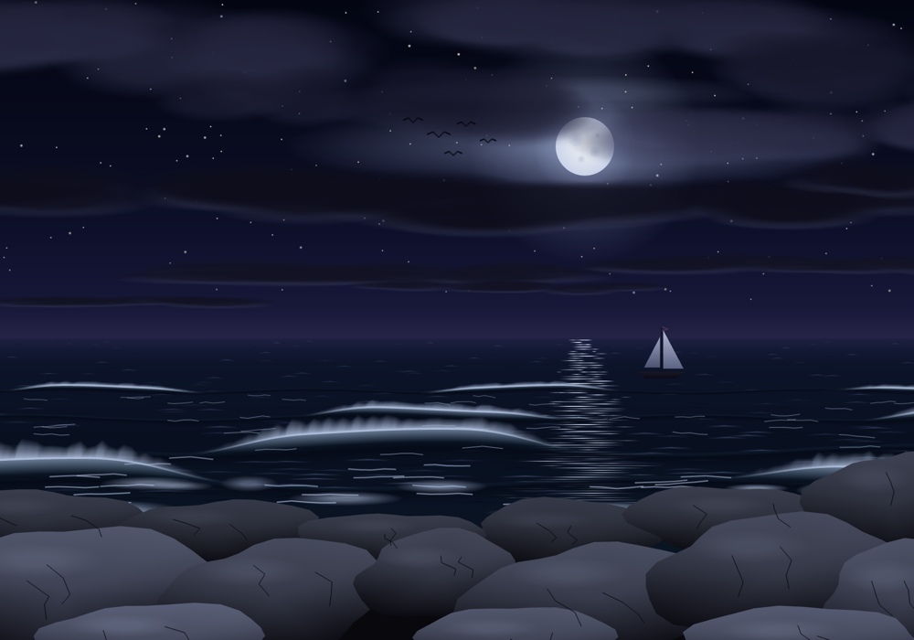

***Figure 15.** The moon moved up and to the right with the arrow keys. The glow and the path of light follow it, because they are drawn with the same `uOffset`.*

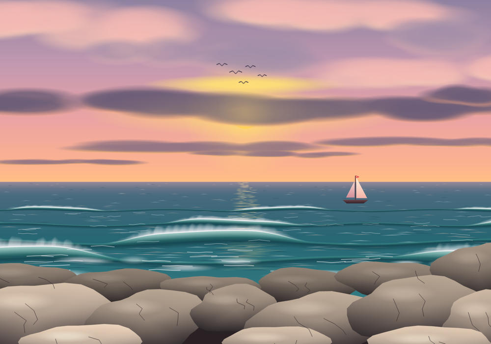

***Figure 16.** The sun moved up with the arrow keys in sunset mode. It is now behind the long dark cloud band: the clouds are drawn after the sun, and only the glow shines through them. The path of light stays under the sun.*

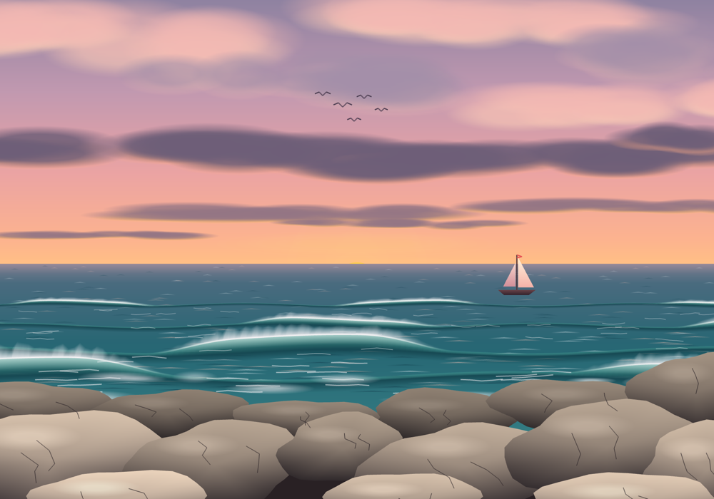

***Figure 17.** The sun moved below the horizon. The sea covers the sun, and the glow and the path of light have faded out through `uAlpha`.*

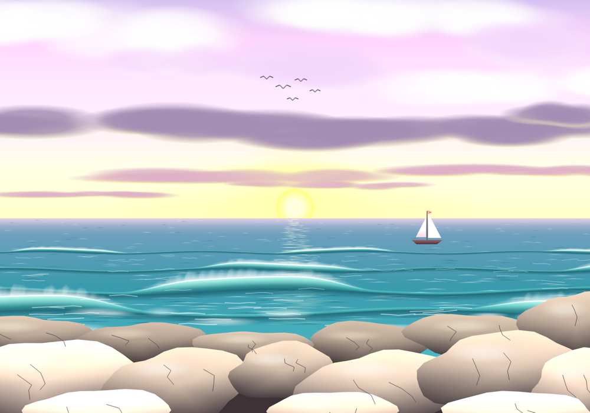

***Figure 18.** Brightness increased with the W key (`uBrightness` = 1.5).*

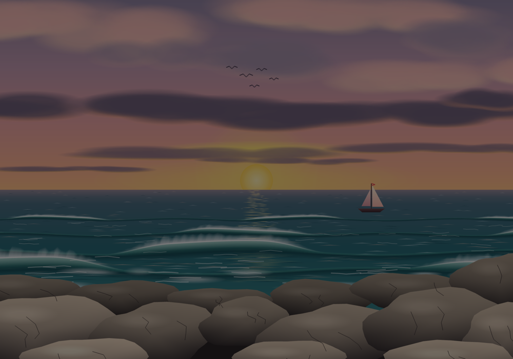

***Figure 19.** Brightness decreased with the S key (`uBrightness` = 0.5).*


### 5.2 Lighting and Shading

This project has no lighting model: there are no light sources, no normals and
no reflection equations. The impression of light comes from colour chosen at the
vertices and interpolated by the rasteriser (Batkuldinova, 2026a).

The sun is lit from the inside: its centre is almost white and its edge is
orange. The clouds are lit from below: every puff has a light orange-pink lower
part under a darker core. The wave faces go from dark teal at the bottom to light
turquoise under the crest, which looks like light shining through the water. The
rocks are light on top and dark at the bottom, as if lit by the sky.

Transparency adds the rest. With blending enabled
(`glBlendFunc(GL_SRC_ALPHA, GL_ONE_MINUS_SRC_ALPHA)`), the glow of the sun is a set
of circles and ellipses whose edges have alpha 0. The glow is drawn a second time
at a quarter of its strength after the clouds, so they look lit from behind. The
path of light on the water fades out through `uAlpha` as the sun goes down:

```cpp
const float reflA = smooth01((g.sunY - (HORIZON - SUN_R)) / (1.5f * SUN_R));
if (reflA > 0.01f) drawMesh(s.sunPath, g.sunX, 0, reflA);
```

The night mode is not a darkening filter. Every vertex has its own night colour,
so the night palette is designed separately: the sky is deep blue, the sea is
navy, the sails and the foam are silver, and the moon has grey craters. The
craters are invisible at sunset because their sunset colour has alpha 0.

### 5.3 Texturing and Animation

No texture mapping is used. No image is loaded, no sampler is declared and no
texture coordinates are attached to the vertices. The effects that would usually
need textures are made from geometry instead: clouds and foam from soft
ellipses, the surface of the rocks from gradients and crack lines, and the
texture of the sea from hundreds of short ripple lines.

There is no animation. The scene is a still picture, and nothing in it depends
on time. The picture changes only when the user presses a key: Space switches
the mode instantly, the arrow keys move the sun or moon, and W and S change the
brightness. The frame is redrawn continuously only so that these changes appear
at once.

## 6. Testing and Evaluation

### 6.1 Testing Methodology

Testing was organised around four procedures.

The first is visual verification of both modes. The program has a screenshot
mode that renders the sunset and the night to image files and exits. After each
change both images were inspected, and the problems found this way were fixed
(section 6.3). For this report, the step-by-step figures in section 5.1 were
rendered the same way from a temporary copy of the program that can switch each
object on or off, while keeping the drawing order of `render()`.

```sh
./build/postcard --screenshots
```

The second is a check against the requirements of the assignment. Each of the
ten requirements was matched to a specific function and line in the code.

The third is the compiler. The program is built with `-Wall -Wextra -Wpedantic`
and produces no warnings.

The fourth is a clean build of the submission. The archive was unpacked into an
empty folder and the project was configured and built there from scratch, which
repeats exactly what the grader will do.

```sh
mkdir -p /tmp/check && cd /tmp/check
unzip ~/graphics/ay240782_a2.zip
cd ay240782_a2
cmake -S . -B build && cmake --build build
./build/postcard
```

### 6.2 Performance Evaluation

The size of the scene was measured by counting the vertices of every object after
it was generated. The results are given in Table 3.

***Table 3. Rendering workload***

| Object | Primitive | Vertices |
|---|---|---|
| Clouds (12 clusters) | triangles | 73 872 |
| Swells (4 rows) | triangles | 13 920 |
| Foam patches | triangles | 7 056 |
| Rocks | triangles | 4 686 |
| Ripples | lines | 3 212 |
| Path of light | lines | 1 760 |
| Sun glow | triangles | 1 392 |
| Foam lace | lines | 1 384 |
| All other objects | points, lines, triangles | 1 480 |
| **Total (29 objects)** | | **108 762** |

The total is about 109 thousand vertices, or 4.3 MB of vertex data. A frame needs
28 draw calls at sunset and 30 at night, because of the two star layers.

Three properties keep the cost low. All geometry is generated once and uploaded
with `GL_STATIC_DRAW`, so no data is sent to the graphics card while the program
runs. Each object is one draw call, so the number of calls depends on the number
of objects and not on the number of vertices. The frame is limited by vertical
synchronisation (`glfwSwapInterval(1)`), so the program draws no more frames than
the display shows.

One design decision is worth noting. Most of the vertices (about 68 percent) are
in the clouds, because every soft puff is a full ring of triangles. A texture
with a soft cloud image would need only a few vertices per puff. For a still
picture of this size the cost is not noticeable, but it shows why real
applications use textures for such effects.

### 6.3 Issues and Debugging

The problems encountered during the work and their solutions are listed in
Table 4.

***Table 4. Issues encountered and their resolution***

| Issue | Cause and resolution |
|---|---|
| CMake and GLFW were missing. | They were installed with `brew install glfw cmake`. |
| `pip install glad` was rejected. | Homebrew's Python is marked as externally managed. `glad` was installed into a separate virtual environment, and only the generated files were kept in the project. |
| There was no simple way to save a screenshot. | The frame is read with `glReadPixels` and written as an uncompressed TGA file, which needs no library. The TGA files were converted to PNG with the macOS `sips` tool. |
| The sun was almost invisible at sunset. | The sun was close to the colour of the horizon and a cloud streak covered it. The horizon was made less yellow, the edge of the sun more orange, and the streak was moved up. |
| The wave rows looked like uniform stripes. | Every part of a row had the same height and foam. The `crest` function was made sharper, so foam appears only in some places and the rest of the row stays calm. |

Several limitations of the platform were known in advance and were taken into
account in the design, so they never appeared as errors. They are listed in
Table 5.

***Table 5. Platform constraints handled in the design***

| Constraint | How it is handled |
|---|---|
| macOS creates a core profile context only if it is requested as forward-compatible. | `GLFW_OPENGL_FORWARD_COMPAT` is set to true together with version 3.3 and the core profile. |
| On a Retina screen the framebuffer is 2000 by 1400 pixels while the window is 1000 by 700. A viewport of the window size would fill only a quarter of the window. | The viewport is taken from `glfwGetFramebufferSize`, and the point size of the stars is scaled by the same factor. |
| The core profile on macOS does not support `glLineWidth` above one. | Thick lines are drawn as several parallel thin lines (section 4.3). |
| Points are drawn as squares. | The fragment shader discards the corners with `gl_PointCoord` and fades the edge, so stars are round and soft. |

## 7. Conclusion and Future Work

A complete 2D scene, "Sunset by the Sea", was implemented with the modern OpenGL
pipeline. The sky, the sun and its glow, the clouds, the sea with ripples and
swells, the path of light, the boat, the gulls, the foam, the rocks and the stars
are all built from points, lines and triangles generated by the program. A night
mode, a movable sun or moon and a brightness control are connected to the
keyboard through uniform variables.

All requirements of the assignment are met:

| # | Requirement | Where it is met |
|---|---|---|
| 1 | One window, one scene | `main()` creates one 1000×700 window; `render()` draws the scene |
| 2 | At least 5 objects | 12 kinds of objects, each built by its own `build*()` function |
| 3 | `GL_POINTS`, `GL_LINES`, `GL_TRIANGLES` | stars; path of light, ripples, foam lace, cracks, mast, gulls; everything else |
| 4 | Complex objects from basic primitives | circles, soft ellipses, clouds, swells, rocks, thick lines (section 4.3) |
| 5 | VAO and VBO | `Mesh::upload()`, one VAO and VBO per object |
| 6 | At least 4 RGB colours | yellow, peach, pink, lilac, teal, turquoise, white, beige-grey, red and more |
| 7 | Colour interpolation | sky, sea, sun, wave faces, rocks, sails |
| 8 | Vertex and fragment shader | `VERTEX_SHADER` and `FRAGMENT_SHADER` in `main.cpp` |
| 9 | Uniform variables | `uNight`, `uOffset`, `uBrightness`, `uAlpha` |
| 10 | Interaction | Space, arrow keys, W/S, P, Esc |

The program builds without warnings, and the submitted archive was checked by
building it from scratch in an empty folder.

Several directions follow naturally from this work. The most direct one is
animation driven by time: the boat, the clouds and the waves are already placed
through `uOffset`, so moving them only requires changing that offset every frame,
and the day and night switch could become a smooth transition by changing
`uNight` gradually. Soft clouds and foam could use textures instead of rings of
triangles, which would cut the number of vertices by about two thirds.
Transformation matrices would allow rotation and scaling. Finally, a lighting
model with normals would replace the hand-chosen gradients with light computed
from the position of the sun.

## 8. References

Angel, E., and Shreiner, D. (2014) *Interactive Computer Graphics: A Top-Down
Approach with WebGL*. 7th ed. Pearson.

Apple Inc. (n.d.) *OpenGL on macOS*. Apple Developer Documentation. Available at:
<https://developer.apple.com/documentation/>

Astana IT University (2026) *Computer Graphics Fundamentals. Assignment 2: OpenGL
Digital Postcard*.

Batkuldinova, K. (2026a) *Computer Graphics Fundamentals. Lecture 1:
Introduction, Image Formation, Models and Architectures*. Astana IT University,
Moodle.

Batkuldinova, K. (2026b) *Programming with OpenGL. Part 1: Background*. Computer
Graphics Fundamentals, Lecture 1.2. Astana IT University, Moodle.

Batkuldinova, K. (2026c) *Programming with OpenGL. Part 3: Shaders*. Computer
Graphics Fundamentals, Lecture 2.1. Astana IT University, Moodle.

Batkuldinova, K. (2026d) *Programming with OpenGL. Part 5: More GLSL*. Computer
Graphics Fundamentals, Lecture 2.2. Astana IT University, Moodle.

Chacon, S., and Straub, B. (2014) *Pro Git*. 2nd ed. Apress. Available at:
<https://git-scm.com/book>

GLFW Project (n.d.) *GLFW Documentation*. Available at:
<https://www.glfw.org/docs/latest/>

Herberth, D. (n.d.) *glad: Multi-Language GL/GLES/EGL/GLX/WGL Loader-Generator*.
Available at: <https://github.com/Dav1dde/glad>

Khronos Group (2010a) *The OpenGL Graphics System: A Specification, Version 3.3
(Core Profile)*. Available at:
<https://registry.khronos.org/OpenGL/specs/gl/glspec33.core.pdf>

Khronos Group (2010b) *The OpenGL Shading Language, Version 3.30*. Available at:
<https://registry.khronos.org/OpenGL/specs/gl/GLSLangSpec.3.30.pdf>

Khronos Group (n.d.) *OpenGL 4 Reference Pages*. Available at:
<https://registry.khronos.org/OpenGL-Refpages/gl4/>

Kitware (n.d.) *CMake Documentation*. Available at:
<https://cmake.org/cmake/help/latest/>

## 9. Appendix

### 9.1 Contents of the submission

The archive contains a single folder with the following files.

| File | Purpose |
|---|---|
| `main.cpp` | The whole program: shaders, geometry, input and rendering |
| `CMakeLists.txt` | Builds the program and the GLAD loader |
| `glad/` | OpenGL 3.3 core function loader generated by GLAD |
| `README.md` | This report |
| `screenshot_sunset.png` | The scene in sunset mode |
| `screenshot_night.png` | The scene in night mode |
| `screenshots/` | The figures of this report: 13 building steps, the wireframe view and 5 interaction results |

To build and run (on macOS first install `brew install glfw cmake`; on Ubuntu
`sudo apt install libglfw3-dev cmake`):

```sh
cmake -S . -B build
cmake --build build
./build/postcard
```

### 9.2 The fragment shader

```glsl
#version 330 core
in vec4 vColor;
out vec4 FragColor;

uniform bool uRoundPoints;

void main()
{
    vec4 c = vColor;
    if (uRoundPoints) {
        float r = length(gl_PointCoord - vec2(0.5));
        if (r > 0.5) discard;
        c.a *= smoothstep(0.5, 0.1, r);
    }
    FragColor = c;
}
```

### 9.3 The CMake file

```cmake
cmake_minimum_required(VERSION 3.16)
project(SunsetPostcard LANGUAGES C CXX)

set(CMAKE_CXX_STANDARD 17)
set(CMAKE_CXX_STANDARD_REQUIRED ON)
if(NOT CMAKE_BUILD_TYPE)
    set(CMAKE_BUILD_TYPE Release)
endif()

find_package(OpenGL REQUIRED)
find_package(glfw3 3.3 REQUIRED)

add_library(glad STATIC glad/src/glad.c)
target_include_directories(glad PUBLIC glad/include)

add_executable(postcard main.cpp)
target_link_libraries(postcard PRIVATE glad glfw OpenGL::GL ${CMAKE_DL_LIBS})

if(MSVC)
    target_compile_options(postcard PRIVATE /W4)
else()
    target_compile_options(postcard PRIVATE -Wall -Wextra -Wpedantic)
endif()
```

### 9.4 Repository

The complete history of the work is available at
<https://github.com/Altusha4/opengl-assignment-1>
